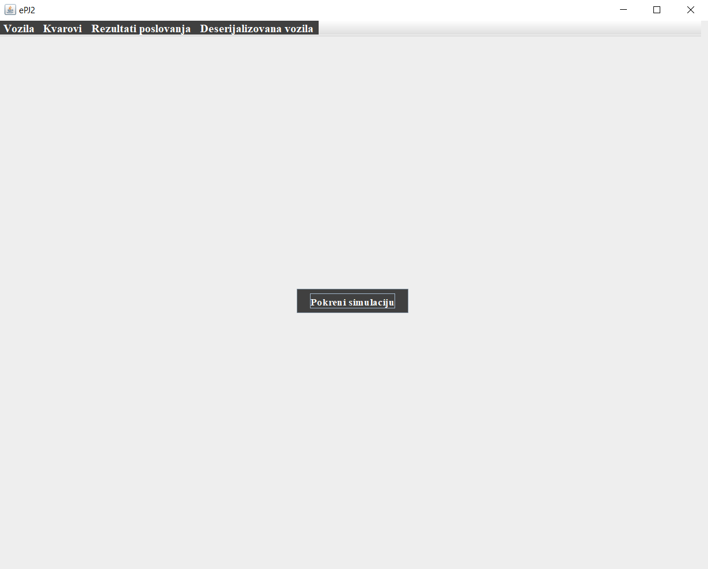
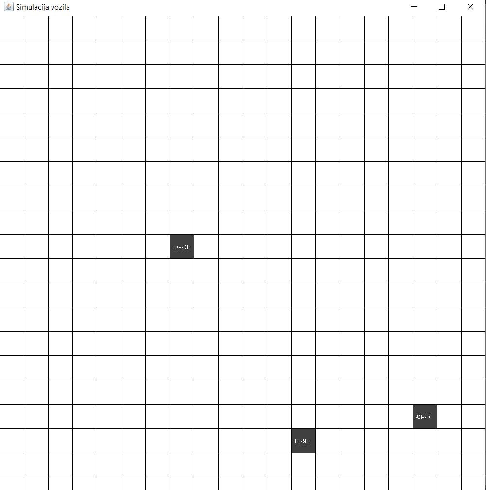
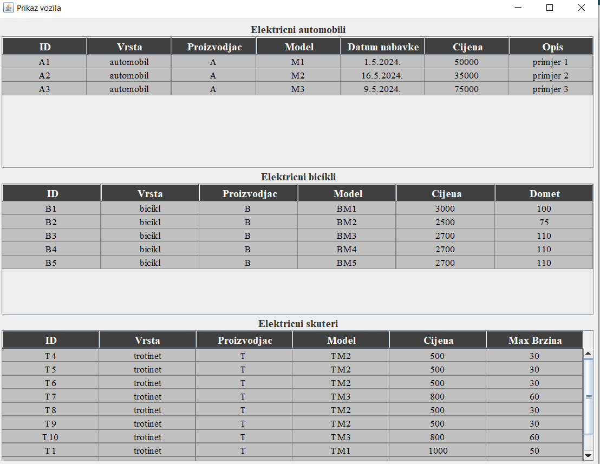
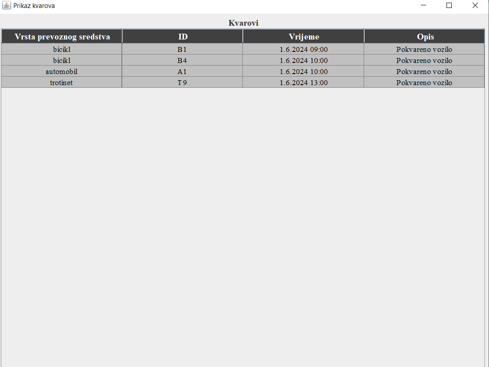
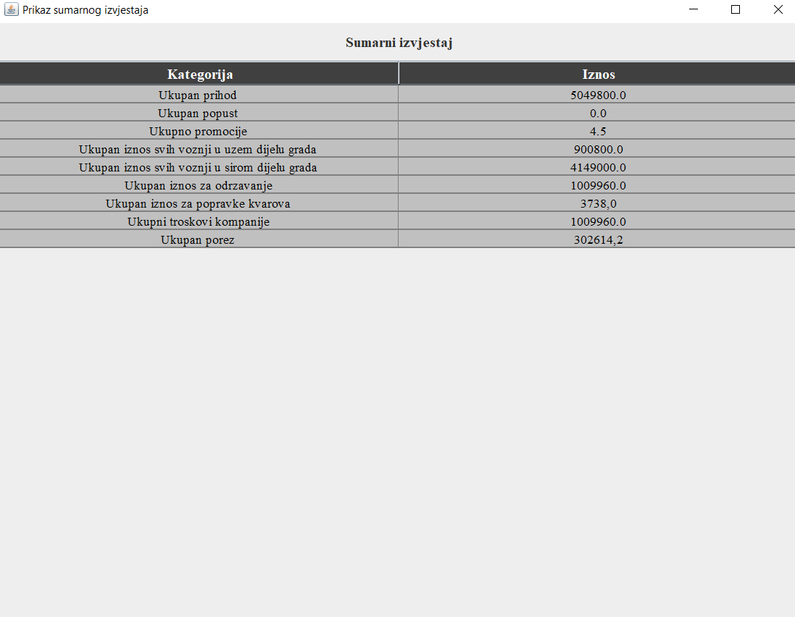
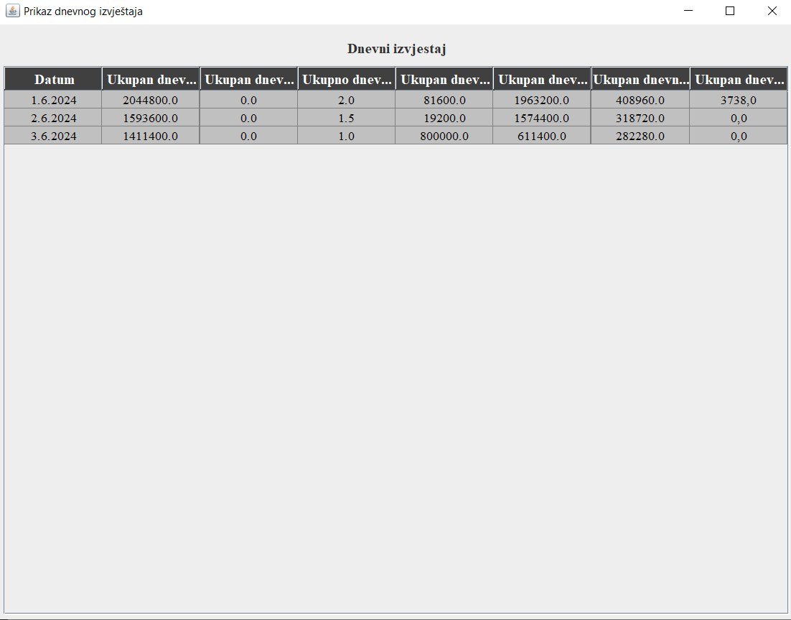
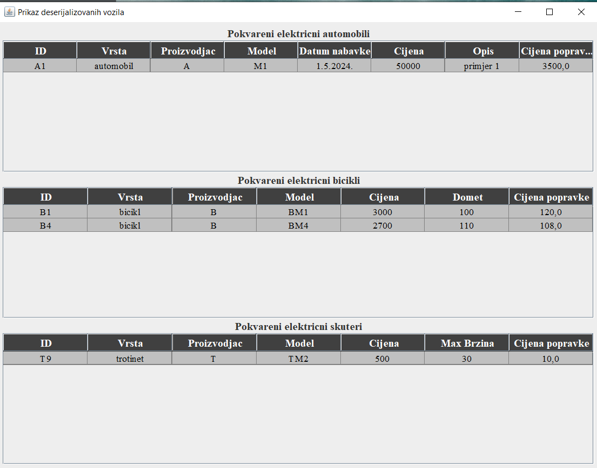

# VehicleRentalCompany
## Description
University project in the form of a Swing GUI application implemented in Java. The application simulates the work of a company that rents electric vehicles. When renting a means of transport, data about the user, pick-up and return locations, and duration of use are recorded. Identification document and driver's license are required. Based on these data, an invoice is generated in txt format. Rental prices depend on time of use and factors such as location, breakdowns and discounts. All parameters are stored in properties files. Rental data is loaded and simulated by rental time in separate threads. Each simulation shows movement on the map, along with vehicle identifier and battery level. Allowed paths are exclusively rectilinear, and the duration of the simulation is divided by the number of fields that will be transported means to go over the map and thus the time spent on one field is defined. Positions means of transport on the map are displayed in real time. After simulating all rentals for a date, there is a 5 second pause and then the next date starts. Finally, an account is created with all data, including discounts, and the files are saved in a specific path. Additionally, it is necessary to perform vehicle serialization.
## Reference to the detailed description
Detailed description of the project can be found in the folder "Description".
## Screenshots

